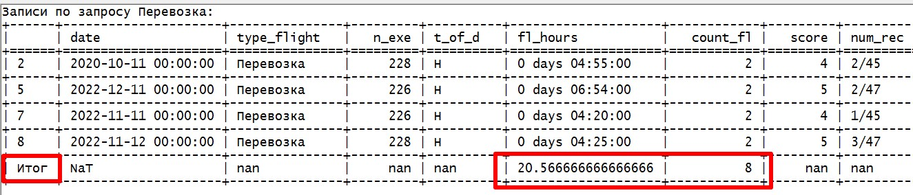

## Прикрутить бота к задачам с предыдущего семинара: Информационная система

В рамках практического задания создала телеграм-бот для поденного учета боевых применений (учебных и рабочих задач), который фиксирует информацию по вылетам военной авиации.

Задача - обеспечить возможность:
* внесения записи по полету с необходимыми полями
* удаления записей
* просмотра данных по полетам за день
* получения сводной информации в разрезе видов применений и времени суток
* выборки записей по заданным критериям

В качестве базы данных используется работа с csv файлом.

Информация структурируется в dataframe при помощи библиотеки pandas.

Большие фреймы читать в телеграм не удобно, выборки отправляются файлами: 

1. Для работы с excel файлами также установила
pip install openpyxl 

2. Для формирования таблиц и вывода в md формат
pip install tabulate 

Примеры формируемых файлов приложены.

***
**Команды меню:**

При старте загружается база в DataFrame, меняется формат даты на datetime64, продолжительность полета на timedelta64 - для возможности отбора по дате и суммирования временных дельт:

***

* *Команда /add* - запускается диалог бота с пользователем, в котором бот собирает информацию по заданным полям в список

Запрашивается подтверждение ввода:

***

* *Команда /for_day* - формируются данные выбранного дня

Информация отправляется в удобочитаемом виде:

1. В excel - записи выбранного дня. Перед выгрузкой значения налета часов приводятся к часу при помощи ф-ции apply, иначе выгружаются неверные данные.

2. В txt - записи в табличном формате с итогами дня

Также итоги дублируются в сообщении бота для наглядности

***

* *Команда /data* - пользователю высылается excel файл, содержащий всю собранную базу. 

Формируется свод данных в разрезе видов применений и времени суток, считаются итоги по полям Налет часов и Число вылетов:

Более корректное представление свода в отправленном txt файле

***
* *Команда /select* - предлагает варианты выборки

По каждому из которых отправляются файлы и итоговые значения

Итоги формируются путем добавления новой строки ко фрейму

***
* *Команда /del* - позволяет удалить запись

Кнопка "Отмена" прерывает выполнение операции и предлагает меню команд

Удаление происходит по индексу строки, который бот предлагает посмотреть в файле с записями

В итоге запись удалена, новый набор данных переиндексирован

***

Бот https://t.me/flight_accounting_bot

На момент просмотра может быть выключен) 

При тестировании прошу не ошибаться в формате запрашиваемой информации, иначе получите -ooops) - проверку корректности ввода через регулярные выражения только предстоит настроить))

